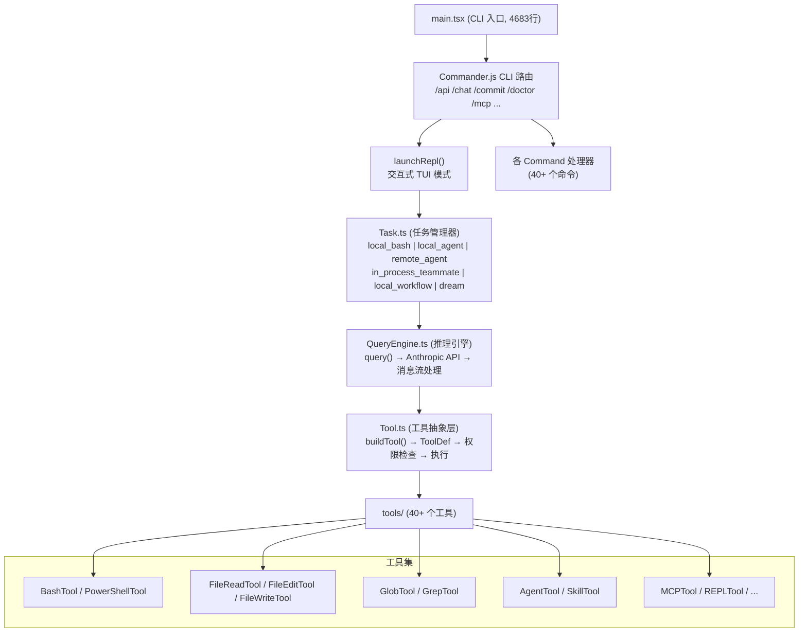
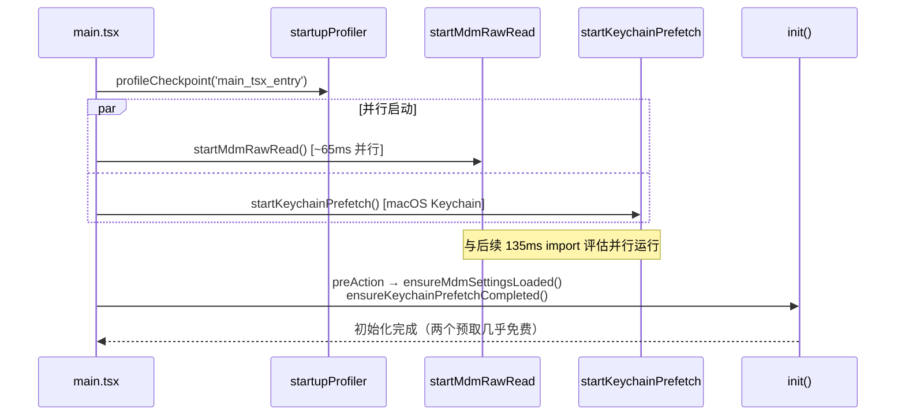
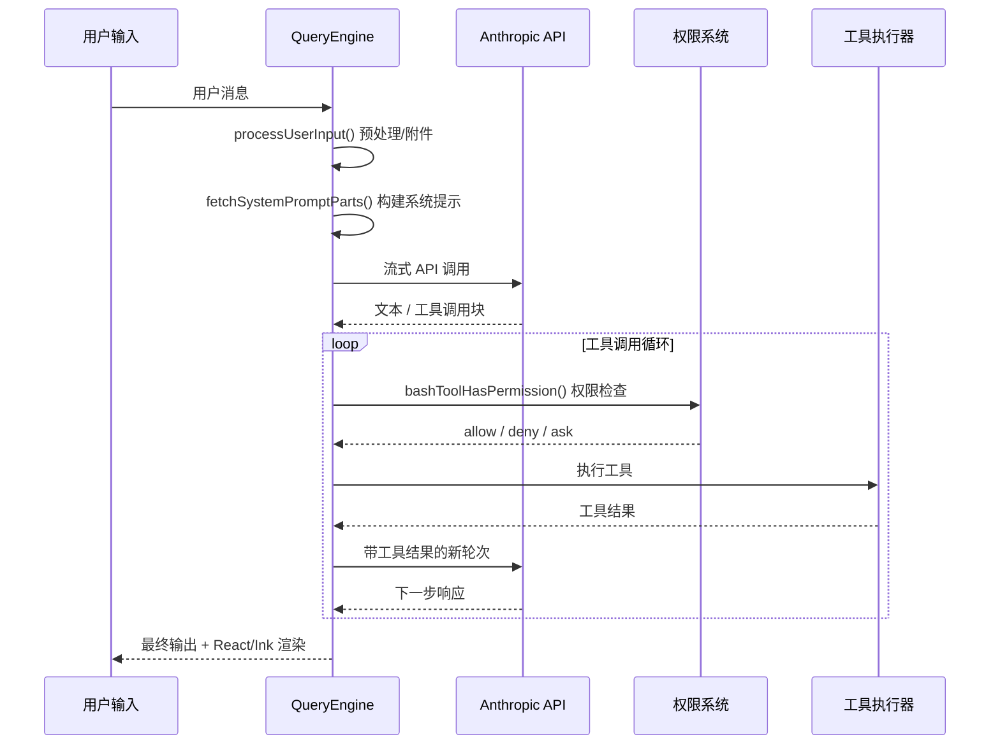
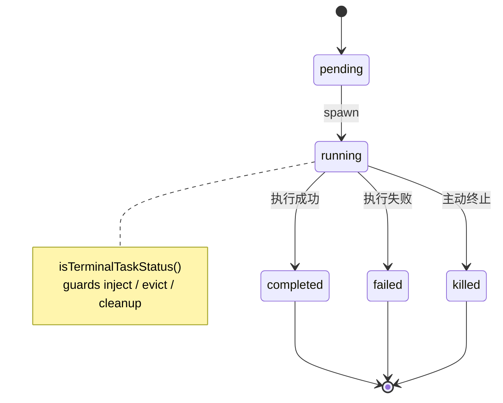
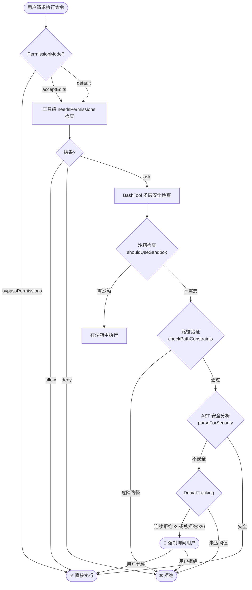
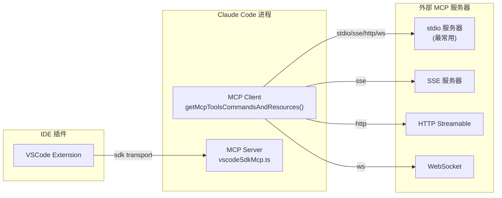
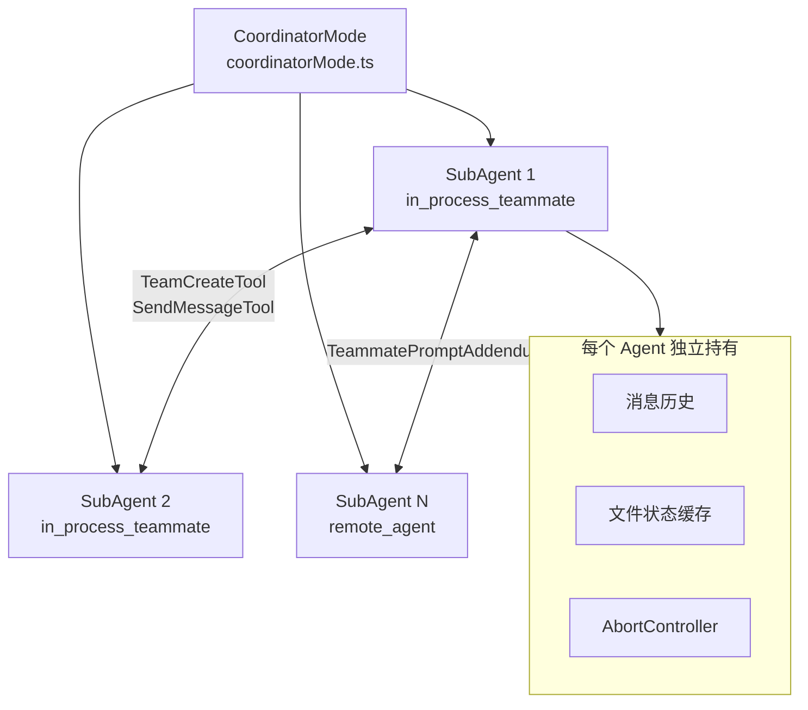
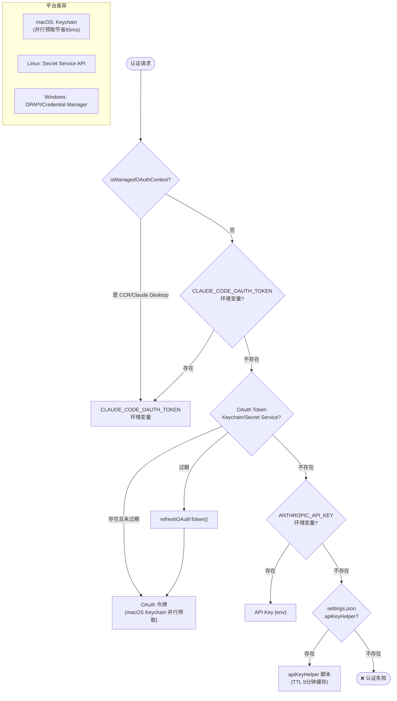
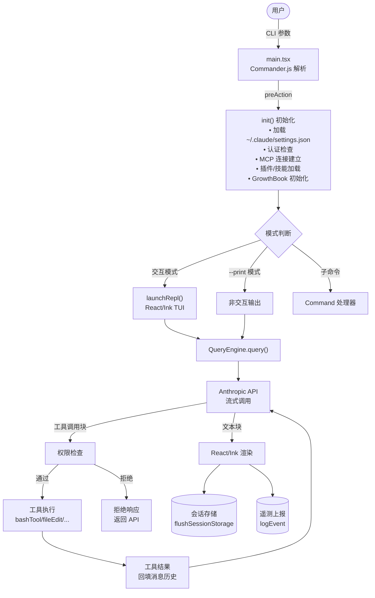

# Claude Code 架构文档

> 版本：2.1.88  
> 还原自：`@anthropic-ai/claude-code` npm 包 source map  
> 仅供研究，版权归 Anthropic 所有

---

## 一、整体架构

Claude Code 是一个基于终端的 AI Agent 框架，使用 **Bun** 作为运行时，**React/Ink** 构建 TUI 界面，**Anthropic SDK** 驱动 LLM 推理。



---

## 二、核心模块详解

### 2.1 入口层（`main.tsx` — 4683 行）

**职责**：解析 CLI 参数、初始化所有子系统、路由到对应模式。

**启动优化链**（并行化关键路径，节省 ~65ms）：



**功能模式路由**：
- `--print` / `-p`：无交互打印模式
- `--repl`：交互式 REPL
- `COORDINATOR_MODE`（feature flag）：多 Agent 协调器模式
- `KAIROS`（feature flag）：助手 AI 模式

---

### 2.2 查询引擎（`QueryEngine.ts`）

**职责**：管理与 Claude API 的消息往返，处理工具调用循环。



---

### 2.3 任务系统（`Task.ts` + `tasks/`）

| TaskType | 前缀 | 说明 |
|----------|------|------|
| `local_bash` | `b` | 本地 Shell 命令执行 |
| `local_agent` | `a` | 本地子 Agent |
| `remote_agent` | `r` | 远程 Agent（通过 API） |
| `in_process_teammate` | `t` | 进程内队友 Agent |
| `local_workflow` | `w` | 本地工作流 |
| `monitor_mcp` | `m` | MCP 监控任务 |
| `dream` | `d` | 自主探索模式 |

**任务 ID 格式**：`{前缀}{8位随机字符(base36)}`，例如 `b-x7k9m2p1`  
**熵**：36⁸ ≈ 2.8 万亿组合，可抵抗暴力符号链接攻击。

**任务状态机**：



---

### 2.4 工具系统（`Tool.ts` + `tools/`）

**工具定义结构**：

```typescript
type ToolDef<Input> = {
  name: string
  description: string
  inputSchema: z.ZodSchema<Input>
  userFacingName?: string
  isEnabled?: () => boolean
  isReadOnly?: () => boolean
  needsPermissions?: (input: Input, ctx: ToolPermissionContext) => PermissionResult
  call: (input: Input, ctx: ToolUseContext) => AsyncGenerator<ToolProgress, ToolResult>
}
```

**40+ 工具分类**：

| 分类 | 工具 |
|------|------|
| 文件操作 | `FileReadTool` `FileEditTool` `FileWriteTool` `GlobTool` `GrepTool` |
| Shell 执行 | `BashTool` `PowerShellTool` `REPLTool` |
| Agent 协作 | `AgentTool` `SkillTool` `TodoWriteTool` |
| MCP 集成 | `MCPTool` `ListMcpResourcesTool` `ReadMcpResourceTool` `McpAuthTool` |
| 任务管理 | `TaskCreateTool` `TaskGetTool` `TaskListTool` `TaskUpdateTool` `TaskStopTool` `TaskOutputTool` |
| 笔记本 | `NotebookEditTool` |
| 规划/模式 | `EnterPlanModeTool` `ExitPlanModeTool` `EnterWorktreeTool` `ExitWorktreeTool` |
| 团队协作 | `TeamCreateTool` `TeamDeleteTool` `SendMessageTool` |
| 其他 | `AskUserQuestionTool` `BriefTool` `ConfigTool` `LSPTool` `SleepTool` `SyntheticOutputTool` `ToolSearchTool` `ScheduleCronTool` `RemoteTriggerTool` |

---

### 2.5 权限系统（`utils/permissions/`）



**PermissionRule 类型**：
- `prefix`：前缀匹配（如 `git:*`）
- `exact`：精确命令匹配
- `wildcard`：通配符匹配（如 `npm run *`）

---

### 2.6 MCP 集成（`services/mcp/`）

Claude Code 同时作为 **MCP 客户端**（调用外部工具）和 **MCP 服务端**（暴露工具给 IDE）。



**连接范围**：`local` | `user` | `project` | `dynamic` | `enterprise` | `claudeai` | `managed`

---

### 2.7 多 Agent 系统（`coordinator/` + `utils/swarm/`）



---

### 2.8 认证系统（`utils/auth.ts` + `utils/secureStorage/`）



---

## 三、目录结构

```
restored-src/src/
├── main.tsx              # CLI 入口 (4683行)
├── Tool.ts               # 工具抽象类型 (792行)
├── Task.ts               # 任务类型与生命周期
├── QueryEngine.ts        # 推理引擎
├── query.ts              # API 查询封装
├── tools.ts              # 工具注册
├── commands.ts           # 命令注册
├── tools/                # 40+ 工具实现
│   ├── BashTool/         # Shell 执行（含安全模块）
│   ├── FileEditTool/     # 文件编辑
│   ├── AgentTool/        # 子 Agent
│   └── ...
├── commands/             # 40+ CLI 命令
├── services/             # 服务层
│   ├── analytics/        # 遥测 (GrowthBook)
│   ├── api/              # Anthropic API 封装
│   ├── mcp/              # MCP 客户端/服务端
│   ├── oauth/            # OAuth 流程
│   └── ...
├── utils/                # 工具函数 (100+ 文件)
│   ├── permissions/      # 权限系统
│   ├── secureStorage/    # 安全存储
│   ├── bash/             # Bash AST 解析
│   ├── settings/         # 配置管理
│   └── ...
├── state/                # React Context 状态管理
├── coordinator/          # 多 Agent 协调器
├── assistant/            # KAIROS 助手模式
├── plugins/              # 插件系统
├── skills/               # 技能系统
├── memdir/               # Memory 目录管理
└── bootstrap/            # 启动状态
```

---

## 四、关键技术栈

| 层级 | 技术 |
|------|------|
| 运行时 | **Bun**（需要 Bun 编译，使用 `bun:bundle` feature flags） |
| UI 框架 | **React + Ink**（TUI 渲染） |
| CLI 框架 | **Commander.js**（`@commander-js/extra-typings`） |
| LLM SDK | **@anthropic-ai/sdk** |
| MCP SDK | **@modelcontextprotocol/sdk** |
| Shell 解析 | **tree-sitter**（AST 安全分析） |
| 类型验证 | **Zod v4** |
| 功能开关 | **GrowthBook** + `bun:bundle feature()` |
| 认证 | macOS Keychain / Linux Secret Service / OAuth |
| 图像处理 | **sharp**（可选依赖） |

---

## 五、完整数据流


