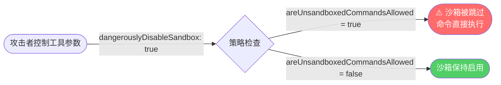

# 安全风险分析与改进建议

> 版本：2.1.88  
> 分析日期：2026-04-02

---

## 一、风险总览

```mermaid
quadrantChart
    title 安全风险矩阵（影响 vs 可能性）
    x-axis 可能性低 --> 可能性高
    y-axis 影响小 --> 影响大
    quadrant-1 重点关注
    quadrant-2 高度警惕
    quadrant-3 持续监控
    quadrant-4 低优先级
    bun:bundle feature flags: [0.3, 0.9]
    dangerouslyDisableSandbox: [0.4, 0.85]
    ReDoS 风险: [0.25, 0.7]
    src/ 路径导入问题: [0.8, 0.4]
    USER_TYPE=ant 代码泄露: [0.3, 0.3]
    明文 API Key 存储: [0.6, 0.6]
    循环依赖: [0.5, 0.3]
    DEPRECATED 函数: [0.7, 0.35]
```

---

## 二、高危风险

### 2.1 Bun Bundle Feature Flags（构建时安全控制）

**位置**：整个 `restored-src/src/` 中 200+ 处 `feature('FEATURE_NAME')` 调用

**风险**：`bun:bundle` 的 `feature()` 是编译时常量求值，在编译时根据功能开关进行死代码消除（DCE）。如果直接运行 TypeScript 源码（非编译产物），所有 `feature()` 调用将返回 `undefined`，导致：
- `coordinatorModeModule` 为 `null`（协调器模式失效）
- `BASH_CLASSIFIER` 功能开关评估失败（安全分类器可能**静默降级**）
- 权限系统行为不可预测

**关键示例**（`bashPermissions.ts`）：
```typescript
// DCE cliff 注释：Bun 的 feature() 求值有每函数复杂度预算
// import 别名会消耗预算，导致 feature('BASH_CLASSIFIER') 无法作为常量求值
// 静默降级为 false，丢弃所有 pendingClassifierCheck
const bashCommandIsSafeAsync = bashCommandIsSafeAsync_DEPRECATED
```

**缓解方案**：
- ✅ 始终使用官方编译产物 `package/cli.js`
- ✅ 不要尝试直接编译 `restored-src` 中的 TypeScript 源码用于生产
- ✅ 如需研究特定功能，以 `cli.js` 为准

---

### 2.2 `dangerouslyDisableSandbox` 沙箱绕过

**位置**：`tools/BashTool/shouldUseSandbox.ts`

**漏洞路径**：



```typescript
if (
  input.dangerouslyDisableSandbox &&
  SandboxManager.areUnsandboxedCommandsAllowed()  // 策略允许时
) {
  return false  // 沙箱被跳过
}
```

> **注意**：`excludedCommands` 是用户便利功能，**不是安全边界**。代码注释已明确：  
> `// NOTE: excludedCommands is a user-facing convenience feature, not a security boundary.`

**缓解方案**：
- ✅ 企业部署时通过 Policy 明确禁用 `areUnsandboxedCommandsAllowed()`
- ✅ 记录所有 `dangerouslyDisableSandbox=true` 的调用事件

---

### 2.3 ReDoS 风险（已有缓解，但需持续关注）

**位置**：`tools/BashTool/bashPermissions.ts`

**背景**：Issue CC-643 记录了复合命令解析时 `splitCommand_DEPRECATED` 可能产生**指数级增长**的子命令数组，导致事件循环阻塞（100% CPU + `/proc/self/stat` 读取 ~127Hz）。

**现有缓解**：
```typescript
export const MAX_SUBCOMMANDS_FOR_SECURITY_CHECK = 50
// 超过上限时降级为 'ask'（安全默认值 — 无法证明安全则询问用户）
```

**残余风险**：构造含 49 个子命令的 payload 可绕过安全检查（但会触发用户确认，不会静默绕过）。

**改进建议**：在安全日志中记录超出限制的情况，监控异常命令模式。

---

## 三、中危风险

### 3.1 `src/` 绝对导入路径（源码编译问题）

**位置**：`restored-src/src/` 中 925 处 `import from 'src/...'`

**风险**：混合使用相对路径（`../../utils/xxx`）和绝对路径（`src/utils/xxx`），在没有正确 `tsconfig.json` 路径映射时无法编译。

**状态**：✅ 已通过 `restored-src/tsconfig.json` 的 `paths` 映射修复：
```json
{ "paths": { "src/*": ["./src/*"] } }
```

---

### 3.2 内部 Anthropic 专用代码泄露

**位置**：多个文件中 `process.env.USER_TYPE === 'ant'` 检查

```typescript
// shouldUseSandbox.ts
if (process.env.USER_TYPE === 'ant') {
  const disabledCommands = getFeatureValue_CACHED_MAY_BE_STALE<{...}>(
    'tengu_sandbox_disabled_commands', { commands: [], substrings: [] }
  )
}
```

**风险**：泄露内部用户类型标识符（`ant` = Anthropic 员工）。攻击者设置 `USER_TYPE=ant` 会触发内部代码路径，但实际影响有限（仅影响命令排除列表）。

**改进建议**：外部部署确保 `USER_TYPE` 不为 `ant`（`scripts/security-check.sh` 已检测）。

---

### 3.3 敏感凭据通过环境变量传递

**位置**：`utils/auth.ts`

| 环境变量 | 风险等级 | 说明 |
|---------|---------|------|
| `ANTHROPIC_API_KEY` | ⚠️ 中 | 明文，可能出现在进程列表 |
| `ANTHROPIC_AUTH_TOKEN` | ⚠️ 中 | 明文令牌 |
| `CLAUDE_CODE_OAUTH_TOKEN` | ⚠️ 中 | 明文 OAuth 令牌 |
| `CLAUDE_CODE_API_KEY_FILE_DESCRIPTOR` | ✅ 低 | 通过 FD 传递，更安全 |
| `CLAUDE_CODE_OAUTH_TOKEN_FILE_DESCRIPTOR` | ✅ 低 | 通过 FD 传递，更安全 |

**改进建议**：
- 优先使用 `_FILE_DESCRIPTOR` 后缀的变量传递敏感凭据
- 容器部署使用 Kubernetes Secrets / Docker Secrets
- 不要在日志、监控系统中记录包含这些变量的命令行

---

### 3.4 API Key 明文存储于配置文件

**位置**：`utils/config.ts`，路径：`~/.claude/settings.json`

**风险**：API Key 以明文形式存储在用户家目录 JSON 文件中。

**现有缓解**：macOS 优先使用 Keychain 存储，有前缀规范化（`normalizeApiKeyForConfig`）。

**改进建议**：
- Linux/Windows 应使用系统密钥管理器而非明文配置文件
- 配置文件权限应设为 `600`（`scripts/security-check.sh` 已检测）

---

## 四、低危风险 / 代码质量问题

### 4.1 大量 `_DEPRECATED` 函数仍在使用

**数量统计**：16 个标记为 `_DEPRECATED` 的函数，被调用 **190+ 次**

| 函数 | 调用次数 | 风险 |
|------|---------|------|
| `splitCommand_DEPRECATED` | 190+ | 安全模块中高频，含 ReDoS 历史 |
| `getSettings_DEPRECATED` | 多处 | 配置读取 |
| `writeFileSync_DEPRECATED` | 少数 | 文件写入 |
| `execSyncWithDefaults_DEPRECATED` | 少数 | 同步命令执行 |

**改进建议**：逐步迁移到非 deprecated 替代函数，优先迁移安全相关路径。

---

### 4.2 Keychain 预取超时未充分处理

**位置**：`utils/secureStorage/keychainPrefetch.ts`

```typescript
const KEYCHAIN_PREFETCH_TIMEOUT_MS = 10_000  // 10 秒超时

// 超时时不缓存结果，让同步读取重试
resolve({
  stdout: err ? null : stdout?.trim() || null,
  timedOut: Boolean(err && 'killed' in err && err.killed),
})
```

**风险**：Keychain 访问超时（10秒）会导致认证延迟，但不会完全失败（有重试路径）。

---

### 4.3 循环依赖（通过 lazy require 规避）

**位置**：`main.tsx` 顶部注释：
```typescript
// Lazy require to avoid circular dependency: teammate.ts -> AppState.tsx -> ... -> main.tsx
const getTeammateUtils = () => require('./utils/teammate.js')
```

**风险**：循环依赖是架构层面的问题，lazy require 是临时 workaround。

---

## 五、安全最佳实践

### 生产部署检查清单

```bash
# 运行内置安全检查脚本
bash scripts/security-check.sh
```

该脚本检查：
1. 危险环境变量（`USER_TYPE=ant`、`CLAUDE_CODE_SKIP_TRUST_CHECK` 等）
2. 配置文件权限（`~/.claude/settings.json` 应为 `600`）
3. API Key 存储方式
4. Node.js 版本合规
5. CLI 可运行性验证

---

### 企业部署 Policy 配置

通过 MDM 或企业策略配置以下字段防止安全绕过：

```json
{
  "permissions": {
    "allow": [],
    "deny": [],
    "additionalDirectories": []
  },
  "sandbox": {
    "enabled": true,
    "allowUnsandboxedCommands": false
  },
  "bypassPermissionsMode": "disabled"
}
```

---

## 六、改进实施状态

| 改进项 | 状态 | 说明 |
|--------|------|------|
| 创建 `tsconfig.json`（修复 src/ 路径） | ✅ 已完成 | `restored-src/tsconfig.json` |
| 创建 `bun-bundle.d.ts` 类型声明 | ✅ 已完成 | `restored-src/types/bun-bundle.d.ts` |
| 创建 `package.json`（项目构建配置） | ✅ 已完成 | 支持 `npm start` |
| 更新 `.gitignore`（排除敏感文件） | ✅ 已完成 | 凭据/大文件/日志 |
| 创建架构文档 | ✅ 已完成 | `docs/architecture.md`（含 Mermaid） |
| 创建安全分析文档 | ✅ 已完成 | `docs/security.md`（本文档） |
| 安全配置校验脚本 | ✅ 已完成 | `scripts/security-check.sh` |
| 运行验证 | ✅ 已验证 | `node package/cli.js --version` → `2.1.88 ✓` |
| 安全检查 | ✅ 全部通过 | `bash scripts/security-check.sh` → 全通过 |
